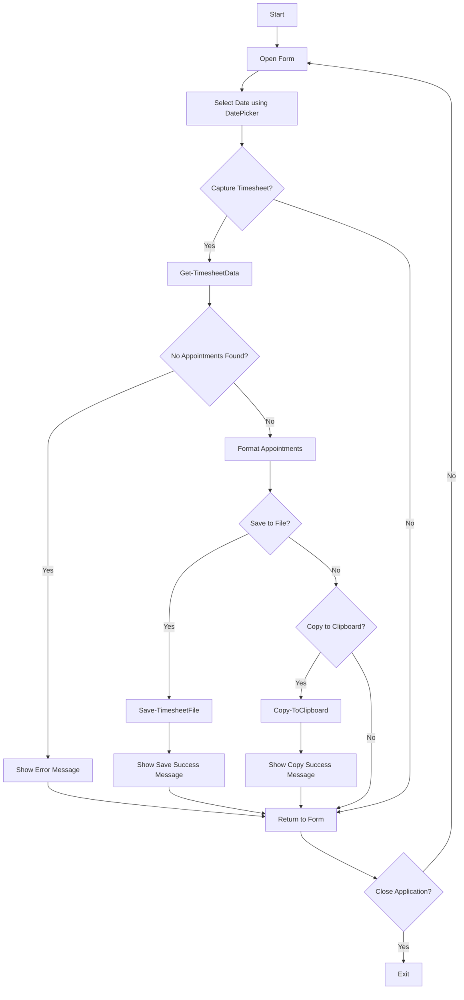

# Timesheet Buddy

Timesheet Buddy is a PowerShell-based Windows Forms application that helps you capture your Outlook calendar appointments for a specific date and either save them to a text file or copy them to the clipboard. It provides a user-friendly interface to select the date, generate the timesheet, and perform actions like saving or copying.

## Features
- **Select Date**: Choose the date for which you want to generate the timesheet.
- **Capture Timesheet**: Retrieve calendar appointments for the selected date and format them into a readable string.
- **Save to File**: Save the formatted timesheet to a text file in your Documents folder.
- **Copy to Clipboard**: Copy the formatted timesheet directly to your clipboard.
- **User-Friendly Interface**: A simple and intuitive GUI with buttons, labels, and a scrolling banner.

## Prerequisites
- PowerShell 5.0 or later.
- Microsoft Outlook installed on your system.

## Installation
1. Ensure you have the necessary prerequisites installed.
2. Copy the script into a `.ps1` file.
3. Run the script using PowerShell script or the TimesheetBuddy.exe

## Usage
1. **Open the Application**: Run the script to open the Timesheet Buddy form.
2. **Select Date**: Use the date picker to choose the desired date.
3. **Capture Timesheet**:
   - Click the "📄 Capture Timesheet" button to generate and save the timesheet to a file.
   - Alternatively, click the "📋 Copy to Clipboard" button to copy the timesheet directly to your clipboard.
4. **Close the Application**: Click the "❌ Close" button to exit the application.

## Visual Representation of App Logic

Below is a simple flowchart representing the logic of the Timesheet Buddy application:



## Screenshots


## Contributing
Feel free to contribute to this project by opening issues or pull requests. Your feedback and improvements are welcome!

## License
This project is licensed under the [MIT License](LICENSE).

---

*Made with by [jmarshall@cloudware.host]*
```

### Notes:
- **Flowchart**: The flowchart uses Mermaid syntax, which can be rendered on GitHub if you have a markdown previewer that supports it.
- **Screenshots**: Replace `https://example.com/timesheet-buddy-screenshot.png` with the actual URL of your screenshot. You can upload images to your repository and use the relative path.

This README provides a comprehensive overview of the application, its features, usage instructions, and a visual representation of its logic.
